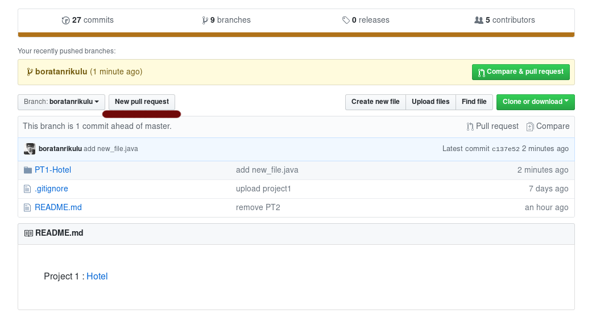
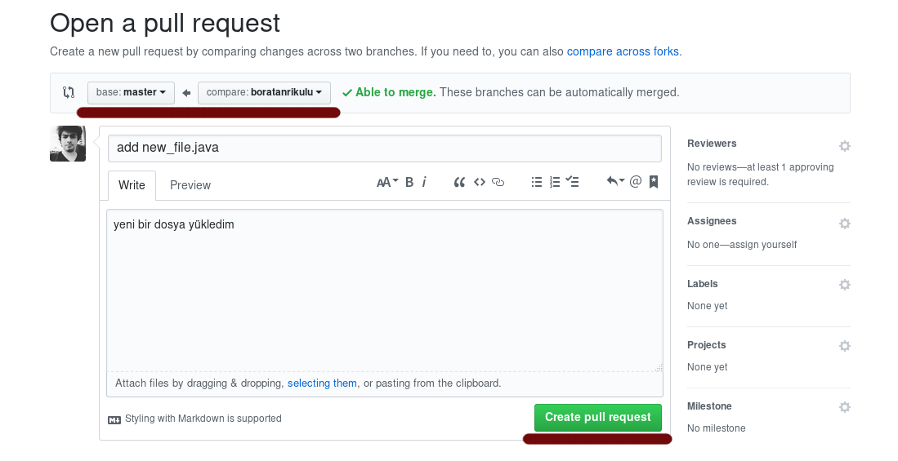
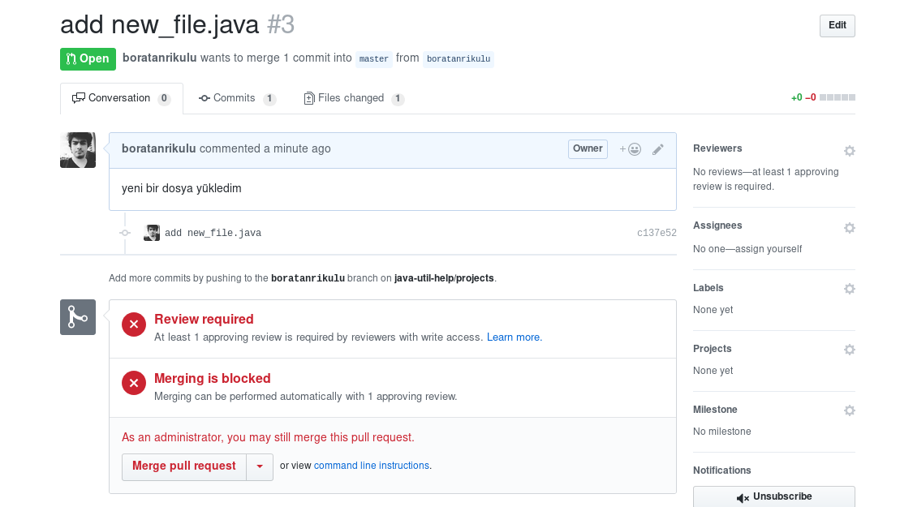

## Projenizi Nasıl Yollayabilirsiniz? 

- Projelerinizi göndermek istiyorsanız **Pull Request** yollayabilirsiniz. Bunun için aşağıdaki adımları uygulayın.

**NOT:** Anlatım organizasyon üyelerine göre hazırlanmıştır. Ama organizasyona üye değilseniz bile fork'lanmış bir repo üzerinden pull request atabilirsiniz. Fork'lama işleminin ve Pull Request işleminin nasıl olacağını görmek için bu anlatıma bakabilirsiniz. -> [Fork ve Pull Request](https://github.com/java-util-help/info/blob/master/informations/HowToFork.md)

#### Projenin Clone'lanması ve Branch'e Geçiş

Projeyi clone'lama ve adınıza açılmış **branch**e geçiş yapmak için aşağıdaki adımları uygulayın.

Öncelikle repo'u clone'layın
```
	git clone https://github.com/java-util-help/[projeAdi].git
```  

Ardından clone'ladığınız repo'nun dizinine girin
```
	cd [projeAdi] && ls
```  

Kendi adınıza açılmış olan branch'e aşağıdaki komut ile geçiş yapın
```
	git checkout [branchAdi]
```

Branch'e geçiş işlemini aşağıdaki komut ile kontrol edin.
```
	git status
```
**On branch [branchAdi]** şeklinde bir çıktı görmelisiniz.

*Bu adımdan sonra projenin bulunduğu dizin altında, projenizi atmak gibi değişiklerde bulunabilirsiniz.*  


#### Yapılan Değişikliklerin Yollanması ve Pull Request

Istediğiniz değişiklerini yaptığınızda ve artık bunu yaptıklarınızı yollamak istediğinizde aşağıdaki adımları uygulayabilirsiniz.

Öncelikle aşağıdaki komut ile hangi dosyaların değiştirildiğini kontrol edin.
```
	git status
```

Ardından bu dosyalar için aşağıdaki işlemi uygulayın.
```
	git add [dosyaAdi] (tüm değişiklikleri eklemek istiyorsanuz "." diyebilirsiniz)
```

Eklenen dosyalara uygun commit'i aşağıdaki komut ile yazın
```
	git commit -m "add [dosyaAdi]"
```

Aşağıdaki komut ile kendinize ait branch'e push'lama işlemini gerçekleştirin.
```
	git push origin [branchAdi]
```

*Ardından da bu adrese gidin*

https://github.com/java-util-help/[projeAdi]/tree/[branchAdi]

ve aşadağıdaki işlemleri uygulayın

  
  

Yukardaki iki işlemi uyguladıktan sonra aşağıdaki sonucu elde edeceksiniz. Bundan sonra yolladığınız pull request incelenip onaylanacaktır.  
