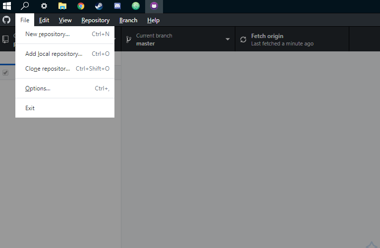
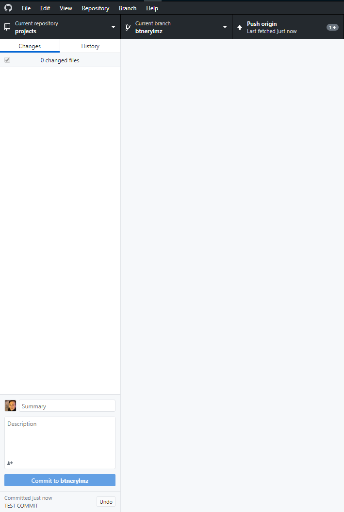

## Projenizi Nasıl Yollayabilirsiniz?

Öncelikle **Github Desktop'ı** bilgisayarımıza kuruyoruz.
Açılan ekrandan giriş yaptıktan sonra aşağıdaki adımları uyguluyoruz.

* Github üzerinden ogranizasyonumuzun icindeki **projects** kısmına gelip üstteki yerden **Url'u** kopyalıyoruz.

* File'dan **Clone repository'e** tıklıyoruz.

* **Url'a** tıklayıp url kısmına kopyaladığımız Url'u yapıştırıyoruz.
* Yapıştırdıktan sonra  clone diyoruz ve clone işleminin bitmesini bekliyoruz.
* İşlem bittikten sonra **fetch origin'e** tıklayıp yüklenmesini bekliyoruz.
* Yükleme işlemi bittikten sonra tekrar aynı yere yıklayıp **pull** işlemini gerçekleştiriyoruz.

* Pull işlemi bittikten sonra **Current brach'a** tıklıyıp kendi ismimiz olan brach'ı seçiyoruz.

* Repository kısımından **Show in Explorer'a** tıklıyoruz.

* Üstte açılan pencere artık bizim Projelerimizi sürükle bırak yapacağımız dizindir.

* İlgili projenin içine girdikten sonra **kendi adınıza** klasör oluşturup içine **.java** uzantılı dosyalarınızı kopyalıyoruz.

* Tekrar Github Desktop'a geliyoruz ve commiti yani yaptığımız değişikleri vs. yazıyoruz.(TEST COMMIT yazan kısıma)
* **Commit to (kullanıcıadınız)** buttonuna tıklıyoruz.

* İşlemi tamamladıktan sonra **push origin'e** tıklıyoruz.
---
# Yukardaki işlemleri tamamladığınızda yolladığınız pull request incelenip onaylanacaktır.
