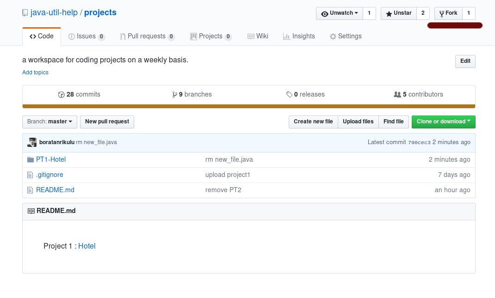
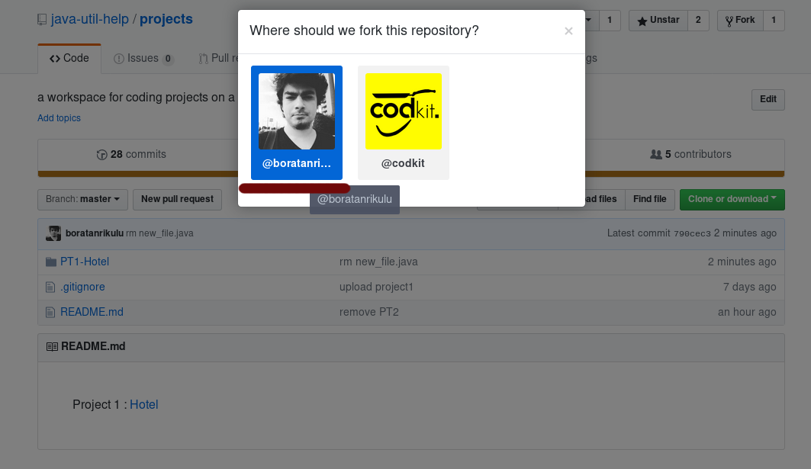
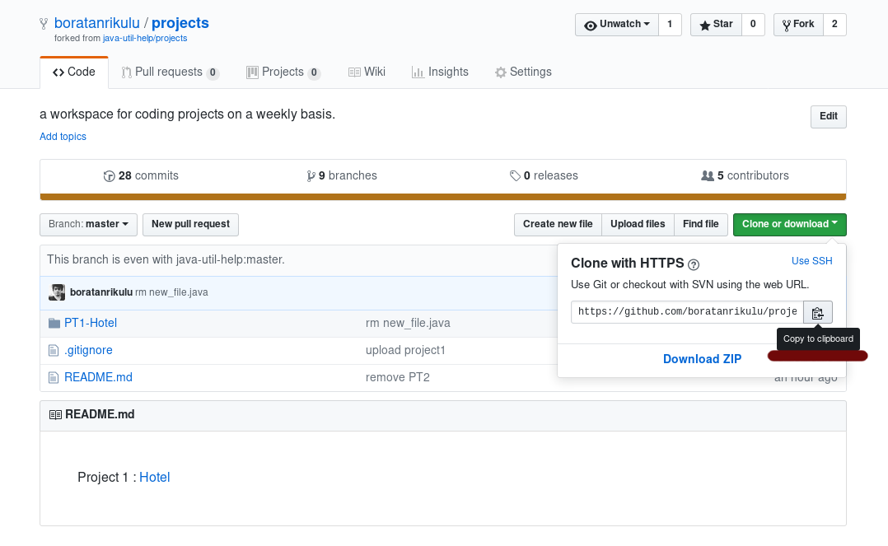
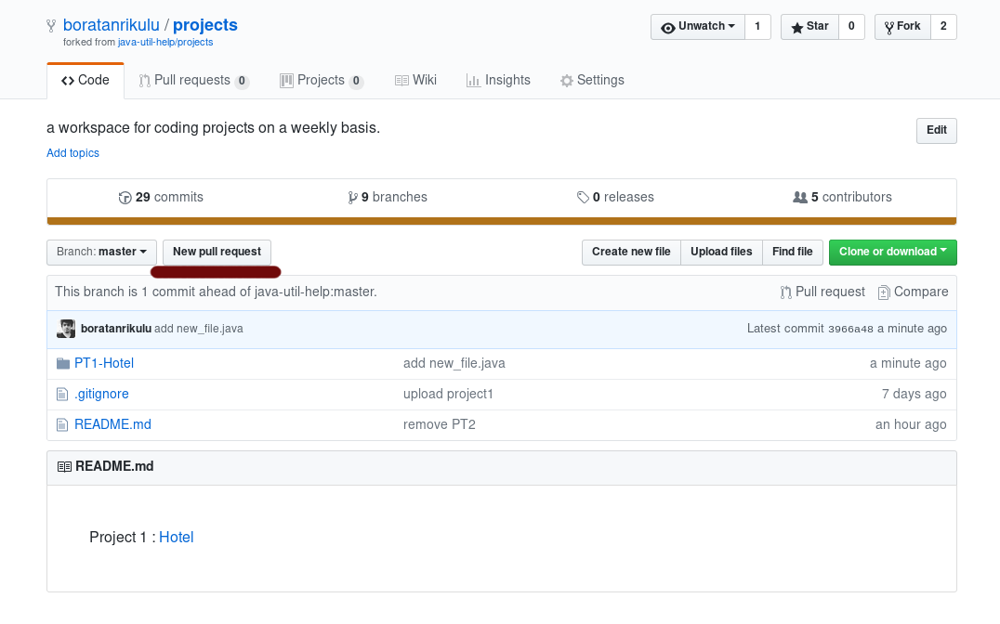
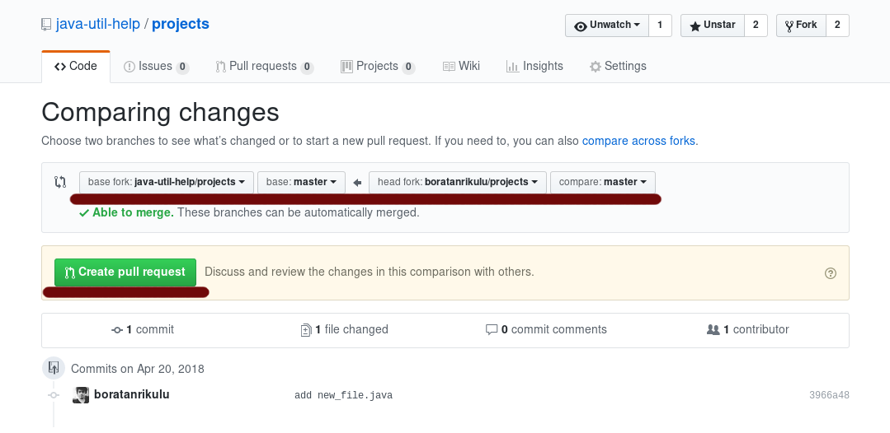
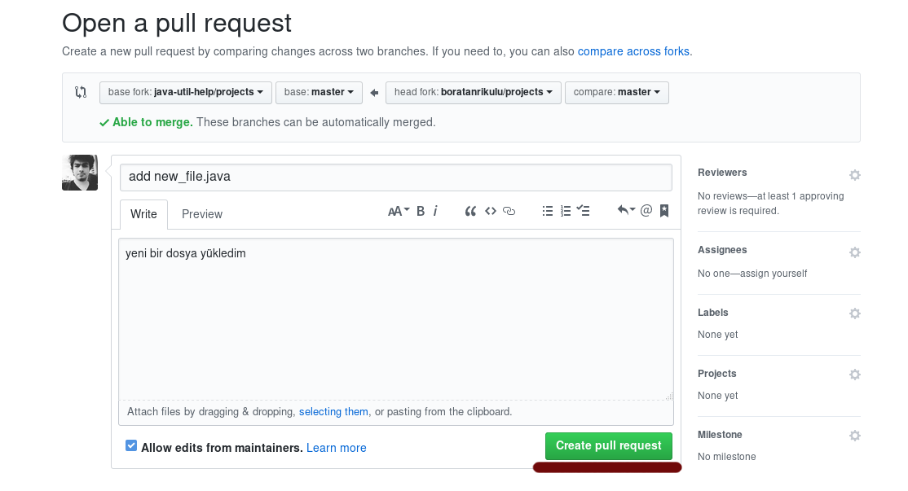
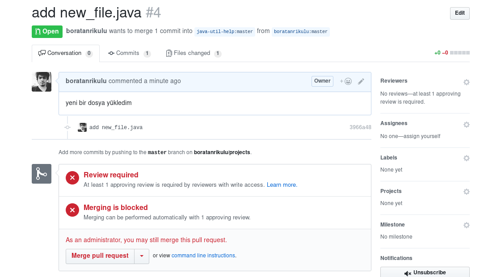

## Projenizi Nasıl Yollayabilirsiniz? 

- Organizasyona üye değilseniz bile fork'lanmış bir repo üzerinden pull request atabilirsiniz. Fork'lama işleminin ve Pull Request işlemleri için aşağıdaki adımları uygulayın.

#### Fork'lama işlemi

Fork'lama işlemini aşağıdaki gibi yapabilirsiniz.

  
  


#### Fork'lanmış Repo Üzerinde Değişiklerin Yapılması

Aşağıdaki komut ile fork'lanmış repo'yu clone'layın
```
	git clone https://github.com/[kullaniciAdi]/[projeAdi].git
```

Ardından clone'ladığınız repo'nun dizinine girin
```
	cd [projeAdi] && ls
```

*Bu adımdan sonra projenin bulunduğu dizin altında, projenizi atmak gibi değişiklerde bulunabilirsiniz.* 

Eklediğini dosyaları göndermek için aşağıdaki işlemi uygulayın.
```
	git add [dosyaAdi] (tüm değişiklikleri eklemek istiyorsanuz "." diyebilirsiniz)
```

Eklenen dosyalara uygun commit'i aşağıdaki komut ile yazın
```
	git commit -m "add [dosyaAdi]"
```

Aşağıdaki komut ile kendinize ait branch'e push'lama işlemini gerçekleştirin.
```
	git push origin master
```

#### Fork'lanmış Proje Üzerinden Pull Request Atmak

Öncelikle fork'lanmış projenin bulunduğu adrese gidin.  
https://github.com/[kullaniciAdi]/[projeAdi]

Ardından aşağıdaki adımları uygulayın

  
  
  
  
 
  

Yukardaki işlemleri uyguladıktan sonra aşağıdaki sonucu elde edeceksiniz. Bundan sonra yolladığınız pull request incelenip onaylanacaktır.  
 
