## Projenizi Nasıl Yollayabilirsiniz?

- Organizasyona üye değilseniz bile fork'lanmış bir repo üzerinden pull request atabilirsiniz. Fork'lama işleminin ve Pull Request işlemleri için aşağıdaki adımları uygulayın.

#### Fork'lama işlemi

Fork'lama işlemini aşağıdaki gibi yapabilirsiniz.

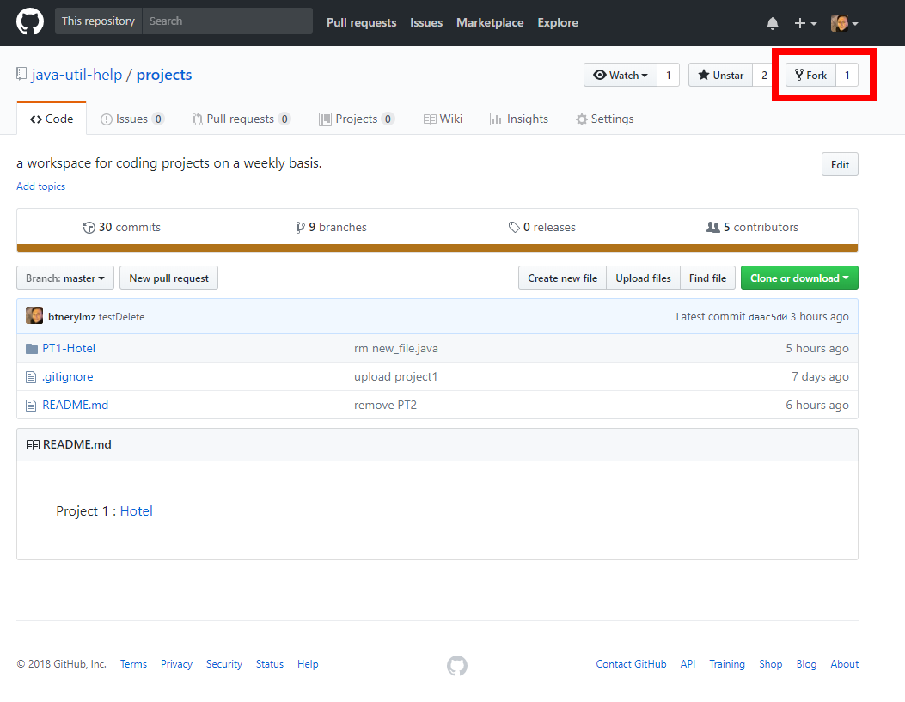  
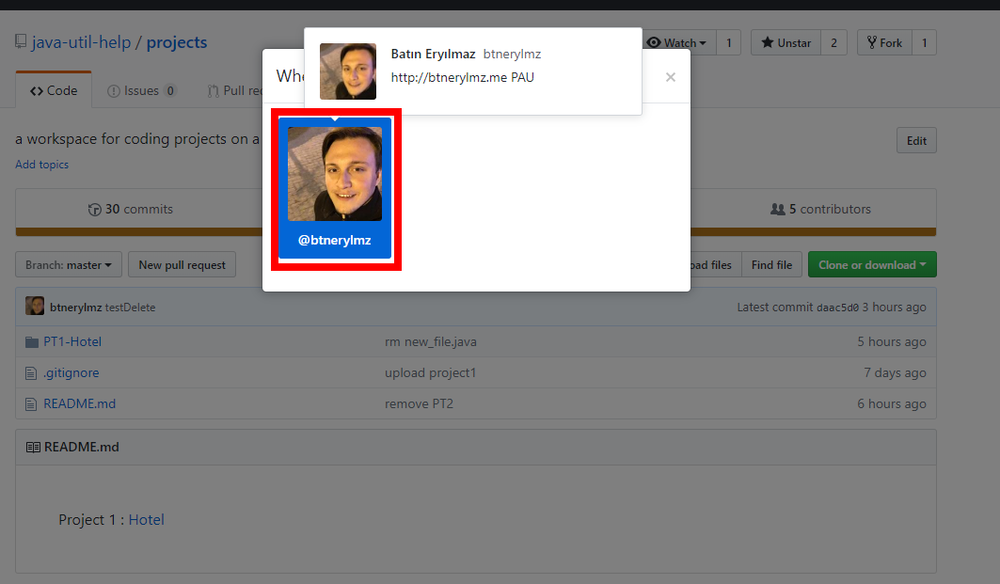  
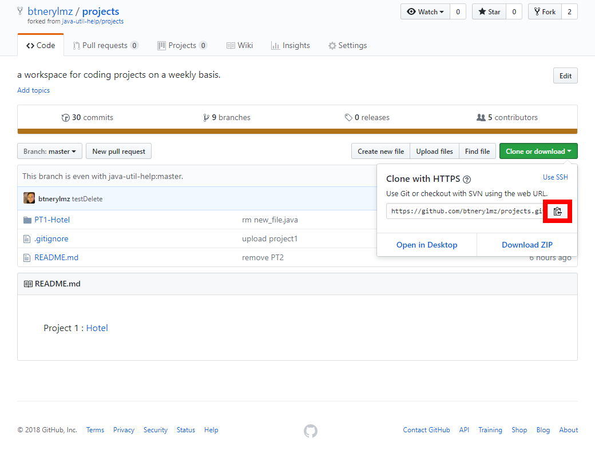

#### Fork'lanmış Repo Üzerinde Değişiklerin Yapılması
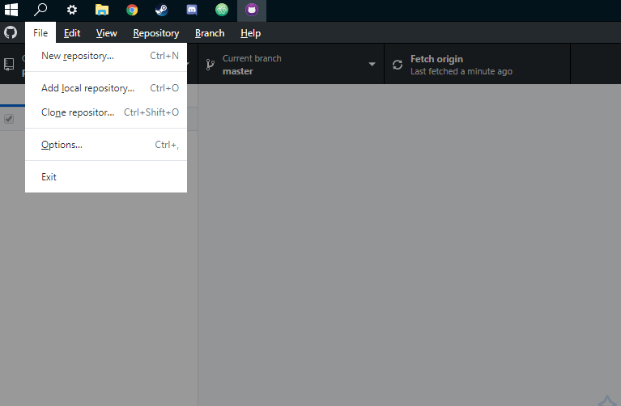
* File'dan **Clone repository'e** tıklıyoruz.

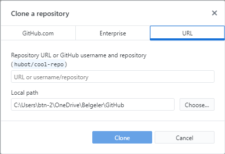
* **Url'a** tıklayıp url kısmına kopyaladığımız Url'u yapıştırıyoruz.
* Yapıştırdıktan sonra  clone diyoruz ve clone işleminin bitmesini bekliyoruz.
* İşlem bittikten sonra **fetch origin'e** tıklayıp yüklenmesini bekliyoruz.
* Yükleme işlemi bittikten sonra tekrar aynı yere yıklayıp **pull** işlemini gerçekleştiriyoruz.

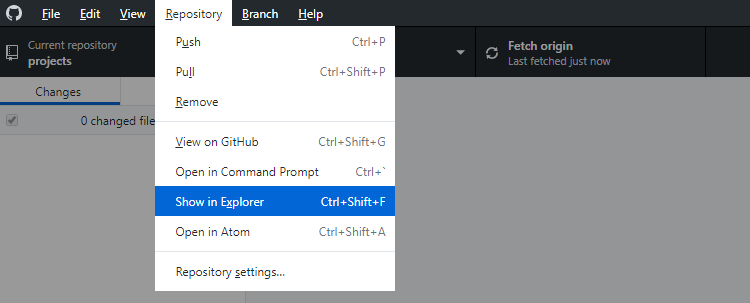
* Repository kısımından **Show in Explorer'a** tıklıyoruz.

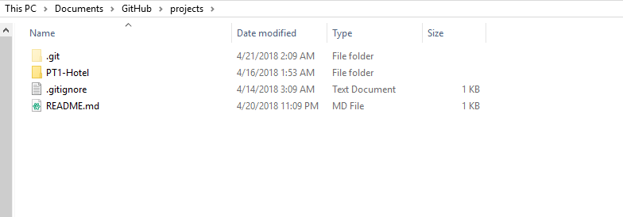
* Üstte açılan pencere artık bizim Projelerimizi sürükle bırak yapacağımız dizindir.

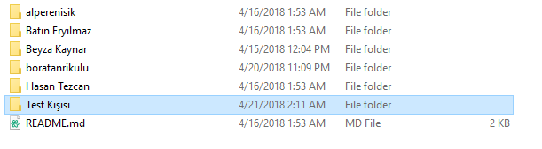
* İlgili projenin içine girdikten sonra **kendi adınıza** klasör oluşturup içine **.java** uzantılı dosyalarınızı kopyalıyoruz.

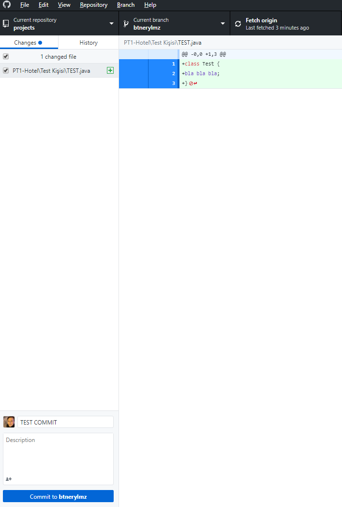
* Tekrar Github Desktop'a geliyoruz ve commiti yani yaptığımız değişikleri vs. yazıyoruz.(TEST COMMIT yazan kısıma)
* **Commit to (kullanıcıadınız)** buttonuna tıklıyoruz.

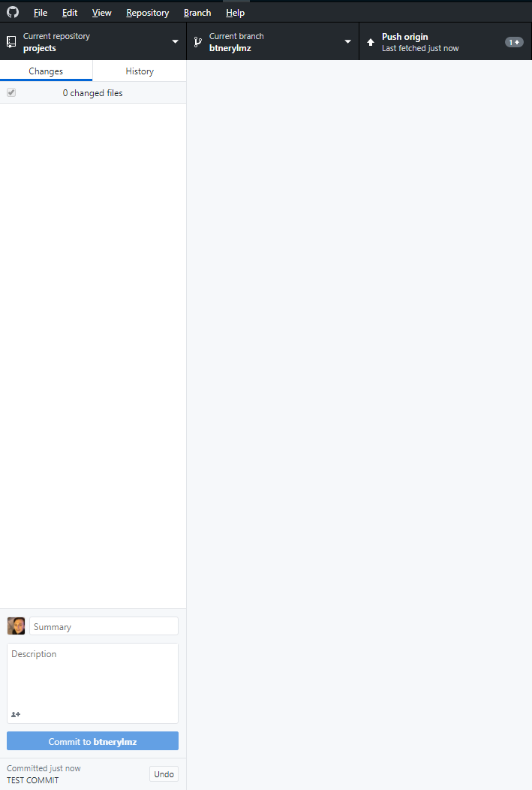
* İşlemi tamamladıktan sonra **push origin'e** tıklıyoruz.

Öncelikle fork'lanmış projenin bulunduğu adrese gidin.  
https://github.com/[kullaniciAdi]/[projeAdi]

Ardından aşağıdaki adımları uygulayın.

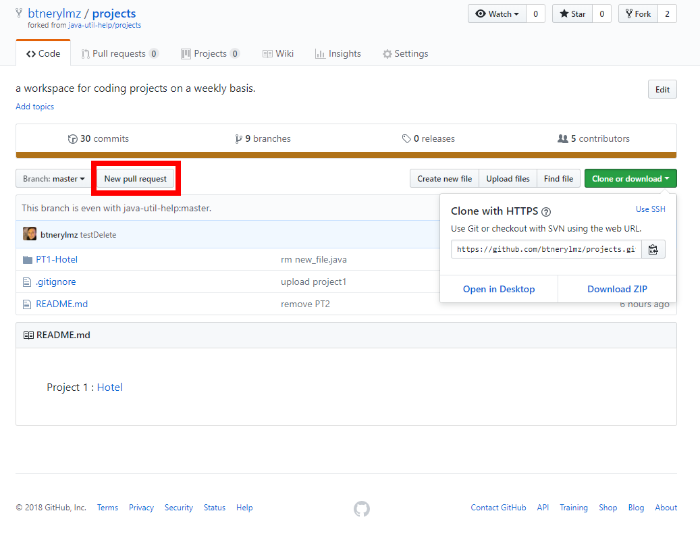  
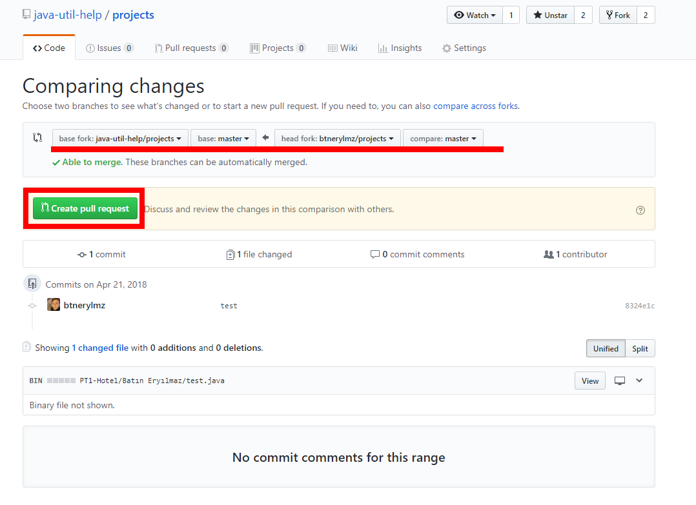
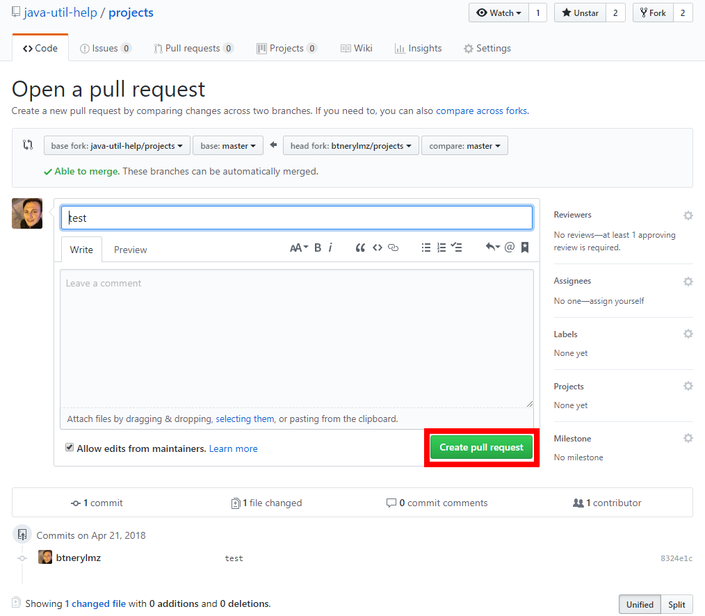  

---
# Yukardaki işlemleri tamamladığınızda yolladığınız pull request incelenip onaylanacaktır.
